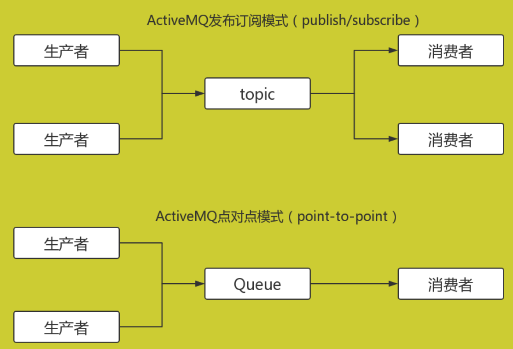

# 消息队列

- 消息队列(MQ,Message Queue)在消息数据传输中的保存作用为数据通信提供了保障和实时处理上的便利。

## ActiveMQ

- 官网：http://activemq.apache.org/
- 安装：https://www.cnblogs.com/biehongli/p/11522793.html

~~~shell
cd /root/mq
tar -zxvf apache-activemq-5.15.12-bin.tar.gz  # 解压
cd /root/mq/apache-activemq-5.15.12/bin
./activemq start  # 启动
./activemq stop  # 停止
./activemq status  # 查看状态
访问后台管理界面，账号和密码默认都是admin的。访问地址：http://39.104.161.233:8161/admin
~~~

- 是Apache下的一个子项目。 类似于ZeroMQ，它能够以代理人和点对点的技术实现队列。同时类似于RabbitMQ，它少量代码就可以高效地实现高级应用场景。RabbitMQ、ZeroMQ、ActiveMQ均支持常用的多种语言客户端 C++、Java、.Net,、Python、 Php、 Ruby等。

### 相关术语

- ActiveMQ ：开源的消息队列服务器

- Broker ：消息中介，每个消息队列服务器中至少有一个broker，是消息队列的载体

- Destination ：消息在broker上的目的地

- Queue ：消息队列

- Topic ：主题

- Message ：消息 

- Producer ：消息产生者

- Consumer ：消息消费者

- Client ：客户端，生产者和消费者都在客户端上

- Server ：Activemq服务器

- BrokerUri ：客户端访问服务器上broker时的Uri

### ActiveMQ的使用方法

- 1）、在点对点或队列模型下，一个生产者向一个特定的队列发布消息，一个消费者从该队列中读取消息。这里，生产者知道消费者的队列，并直接将消息发送到消费者的队列。这种模式被概括为：只有一个消费者将获得消息。生产者不需要在接收者消费该消息期间处于运行状态，接收者也同样不需要在消息发送时处于运行状态。每一个成功处理的消息都由接收者签收。
- 2）、发布者/订阅者模型支持向一个特定的消息主题发布消息。0或多个订阅者可能对接收来自特定消息主题的消息感兴趣。在这种模型下，发布者和订阅者彼此不知道对方。这种模式好比是匿名公告板。这种模式被概括为：多个消费者可以获得消息，在发布者和订阅者之间存在时间依赖性。发布者需要建立一个订阅（subscription），以便客户能够购订阅。订阅者必须保持持续的活动状态以接收消息，除非订阅者建立了持久的订阅。在那种情况下，在订阅者未连接时发布的消息将在订阅者重新连接时重新发布。

### Python接入

- ActiveMQ支持Python访问，提供了基于STOMP协议（端口为61613）的库。
- 安装：https://www.cnblogs.com/luo630/p/9188107.html

~~~shell
pip install stomp.py
# https://pypi.org/project/stomp.py/
~~~

- Python连接示例：https://www.cnblogs.com/traditional/p/11144123.html