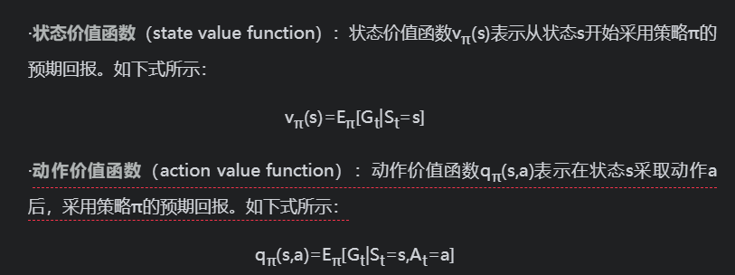
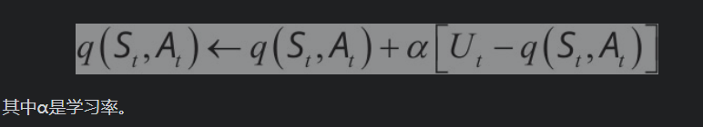
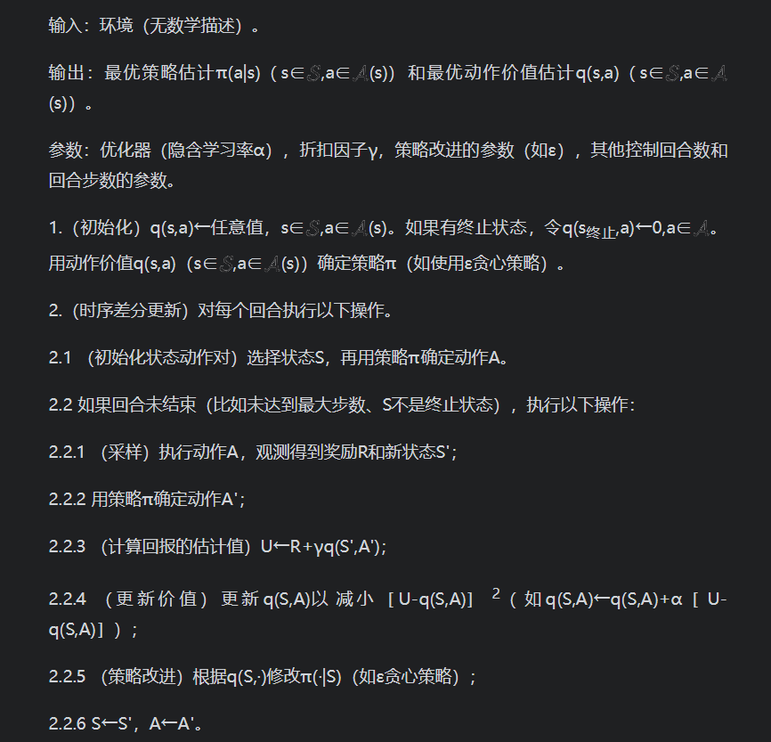
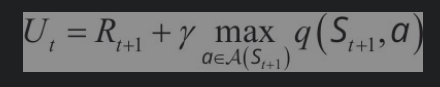
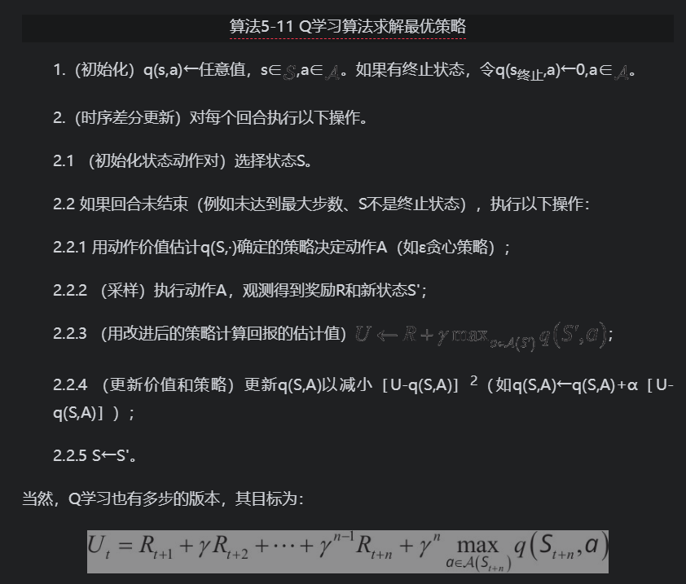

# 强化学习

- 参考书目：http://github.com/zhiqingxiao/rl-book

## 重要知识点

- 能体（agent）是强化学习系统中的决策者和学习者，它可以做出决策和接受奖励信号。一个强化学习系统里可以有一个或多个智能体。我们并不需要对智能体本身进行建模，只需要了解它在不同环境下可以做出的动作，并接受奖励信号。
- 环境（environment）是强化系统中除智能体以外的所有事物，它是智能体交互的对象。环境本身可以是确定性的，也可以是不确定性的。环境可能是已知的，也可能是未知的。我们可以对环境建模，也可以不对环境建模。
- 在智能体/环境接口中，智能体和环境的交互主要有以下三个环节：·
  - 智能体观测环境，可以获得环境的观测（observation），记为O；
  - 智能体根据观测做出决策，决定要对环境施加的动作（action），记为A；
  - 环境受智能体动作的影响，改变自己的状态（state），记为S，并给出奖励（reward），记为R。
- 奖励（reward）：奖励是强化学习系统的学习目标。学习者在行动后会接收到环境发来的奖励，而强化学习的目标就是要最大化在长时间里的总奖励。在机器人走迷宫的例子中，机器人花费的时间和能量就是负奖励，机器人走出迷宫就可以得到正奖励。
- 策略（policy）：决策者会根据不同的观测决定采用不同的动作，这种从观测到动作的关系称为策略。强化学习的学习对象就是策略。强化学习通过改进策略以期最大化总奖励。策略可以是确定性的，也可以不是确定性的。在机器人走迷宫的例子中，机器人根据当前的策略来决定如何移动。
- 深度强化学习（Deep Reinforcement Learning，DRL）算法和非深度强化学习算法。如果强化学习算法用到了深度学习，则这种强化学习可以称为深度强化学习算法。
- 状态价值函数与动作价值函数

### 同策学习（on policy）和异策学习（off policy）

- 同策学习（on policy）：是边决策边学习，学习者同时也是决策者。
- 异策学习（off policy）：则是通过之前的历史（可以是自己的历史也可以是别人的历史）进行学习，学习者和决策者不需要相同。在异策学习的过程中，学习者并不一定要知道当时的决策。例如，围棋AI可以边对弈边学习，这就算同策学习；围棋AI也可以通过阅读人类的对弈历史来学习，这就算异策学习。

### 有模型学习（model-based）和无模型学习（model free）

- 有模型学习（model-based）：在学习的过程中，如果用到了环境的数学模型，则是有模型学习；
- 无模型学习（model free）：如果没有用到环境的数学模型，则是无模型学习。对于有模型学习，可能在学习前环境的模型就已经明确，也可能环境的模型也是通过学习来获得。例如，对于某个围棋AI，它在下棋的时候可以在完全了解游戏规则的基础上虚拟出另外一个棋盘并在虚拟棋盘上试下，通过试下来学习。这就是有模型学习。与之相对，无模型学习不需要关于环境的信息，不需要搭建假的环境模型，所有经验都是通过与真实环境交互得到。

### 回合更新（Monte Carlo update）和时序差分更新（temporal difference update）

- 回合更新（Monte Carlo update）：是在回合结束后利用整个回合的信息进行更新学习；
- 时序差分更新（temporal difference update）：不需要等回合结束，可以综合利用现有的信息和现有的估计进行更新学习。

### 基于价值（value based）和基于策略（policy based）

- 基于价值（value based）：定义了状态或动作的价值函数，来表示到达某种状态或执行某种动作后可以得到的回报。
- 基于策略（policy based）：倾向于选择价值最大的状态或动作；基于策略的强化学习算法不需要定义价值函数，它可以为动作分配概率分布，按照概率分布来执行动作。

### 自益（bootstrap）

- 用一个估计值来估计另外一个估计值的做法又称为自益（bootstrap）。动态规划迭代算法就运用了自益的思想。

## gym库

- Gym库（https://gym.openai.com/）是OpenAI推出的强化学习实验环境库。它用Python语言实现了离散时间智能体/环境接口中的环境部分。除了依赖少量商业库外，整个项目是开源免费的。

- Gym库内置上百种实验环境，包括以下几类。

  - 算法环境：包括一些字符串处理等传统计算机算法的实验环境。

  - 简单文本环境：包括几个用文本表示的简单游戏。

  - 经典控制环境：包括一些简单几何体的运动，常用于经典强化学习算法的研究。

  - Atari游戏环境：包括数十个Atari 2600游戏，具有像素化的图形界面，希望玩家尽可能争夺高分。

  - 二维方块（Box2D）环境：包括一些连续性控制的任务。

  - MuJoCo环境：利用收费的MuJoCo运动引擎进行连续性控制任务。

  - 机械控制环境：关于机械臂的抓取和控制等。

- Gym环境列表可参见网址https://gym.openai.com/envs/。

### gym库使用

- 要使用Gym库，当然首先要导入Gym库。导入Gym库的方法显然是：

~~~python
import gym
~~~

- 在导入Gym库后，可以通过make()函数来得到环境对象。每一个环境都有一个ID，它是形如“Xxxxx-vd”的Python字符串，如'CartPole-v0'、'Taxi-v2'等。环境名称最后的部分表示版本号，不同版本的环境可能有不同的行为。使用取出环境'CartPole-v0'的代码为：

~~~python
env = gym.make('CartPole-v0')
print(env)
# <TimeLimit<CartPoleEnv<CartPole-v0>>>
~~~

- 想要查看当前Gym库已经注册了哪些环境，可以使用以下代码：

~~~python
from gym import envs
env_specs = envs.registry.all()
env_ids = [env_spec.id for env_spec in env_specs]
print(env_ids)
~~~

- 每个环境都定义了自己的观测空间和动作空间。环境env的观测空间用env.observation_space表示，动作空间用env.action_space表示。观测空间和动作空间既可以是离散空间（即取值是有限个离散的值），也可以是连续空间（即取值是连续的）。在Gym库中，离散空间一般用gym.spaces.Discrete类表示，连续空间用gym.spaces.Box类表示。例如，环境'MountainCar-v0'的观测空间是Box(2,)，表示观测可以用2个float值表示；环境'MountainCar-v0'的动作空间是Dicrete(3)，表示动作取值自{0,1,2}。对于离散空间，gym.spaces.Discrete类实例的成员n表示有几个可能的取值；对于连续空间，Box类实例的成员low和high表示每个浮点数的取值范围。
- 接下来使用环境对象env。首先，初始化环境对象env，代码为

~~~python
print(env.reset())
# [-0.04600245  0.01067163 -0.02734837  0.028913  ]
~~~

- 该调用能返回智能体的初始观测，是np.array对象。
- 环境初始化后就可以使用了。使用环境的核心是使用环境对象的step()方法。step()方法接收智能体的动作作为参数，并返回以下4个参数。
  - 观测（observation）：np.array对象，表示观测，和env.reset()返回值的意义相同。
  - 奖励（reward）：float类型的值。
  - 本回合结束指示（done）：bool类型的数值。Gym库里的实验环境大多都是回合制的。这个返回值可以指示在当前动作后游戏是否结束。如果游戏结束了，可以通过“env.reset()”开始下一回合。
  - 其他信息（info）：dict类型的值，含有一些调试信息。不一定要使用这个参数。

- env.step()的参数需要取自动作空间。可以使用以下语句从动作空间中随机选取一个动作：

~~~python
action = env.action_space.sample()
print(action)
# 1
~~~

- 每次调用env.step()只会让环境前进一步。所以，env.step()往往放在循环结构里，通过循环调用来完成整个回合。
- 在env.reset()或env.step()后，可以用以下语句以图形化的方法显示当前环境。

~~~
print(env.step(action))
# (array([-0.01314339,  0.18116391,  0.01175843, -0.31420589]), 1.0, False, {})
~~~

- 使用完环境后，可以使用下列语句关闭环境：

~~~python
env.render()
~~~

- 注意：如果绘制了实验的图形界面窗口，那么关闭该窗口的最佳方式是调用env.close()。试图直接关闭图形界面窗口可能会导致内存不能释放，甚至会导致死机。

~~~python
env.close()
~~~

- 测试智能体在Gym库中某个任务的性能时，学术界一般最关心100个回合的平均回合奖励。至于为什么是100个回合而不是其他回合数（比如128个回合），完全是习惯使然，没有什么特别的原因。对于有些环境，还会指定一个参考的回合奖励值，当连续100个回合的奖励大于指定的值时，就认为这个任务被解决了。但是，并不是所有的任务都指定了这样的值。对于没有指定值的任务，就无所谓任务被解决了或者没有被解决。

- 小车上山：https://github.com/ZhiqingXiao/rl-book/blob/master/chapter01_intro/useGym.ipynb

## SARSA

- “状态/动作/奖励/状态/动作”（State-Action-Reward-State-Action，SARSA）算法。这个算法得名于更新涉及的随机变量(St,At,Rt+1,St+1,At+1)。该算法利用Rt+1+γqt(St+1,At+1)得到单步时序差分目标Ut，进而更新q(St,At)。该算法的更新式为：

- 算法5-5 SARSA算法求解最优策略（显式更新策略）

## Q学习

- 期望SARSA算法将时序差分目标从SARSA算法的Ut=Rt+1+γq(St+1,At+1)改为Ut=Rt+1+γE［q(St+1,At+1)|St+1］，从而避免了偶尔出现的不当行为给整体结果带来的负面影响。Q学习则是从改进后策略的行为出发，将时序差分目标改为

- Q学习算法认为，在根据St+1估计Ut时，与其使用q(St+1,At+1)或v(St+1)，还不如使用根据q(St+1,·)改进后的策略来更新，毕竟这样可以更接近最优价值。因此Q学习的更新式不是基于当前的策略，而是基于另外一个并不一定要使用的确定性策略来更新动作价值。从这个意义上看，Q学习是一个异策算法。算法5-11给出了Q学习算法。Q学习算法和期望SARSA有完全相同的程序结构，只是在更新最优动作价值的估计q(St,At)时使用了不同的方法来计算目标。
- 算法5-11 Q学习算法求解最优策略

